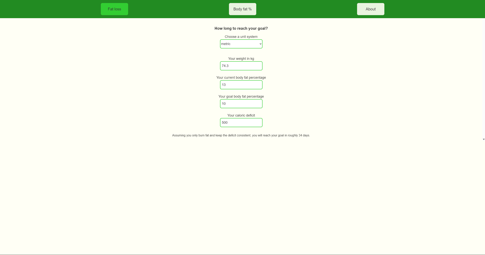
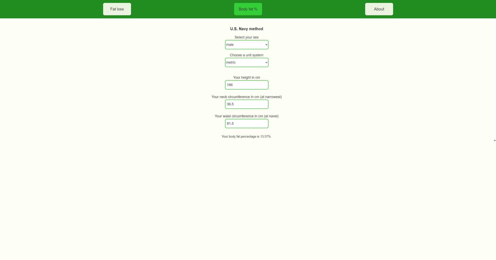
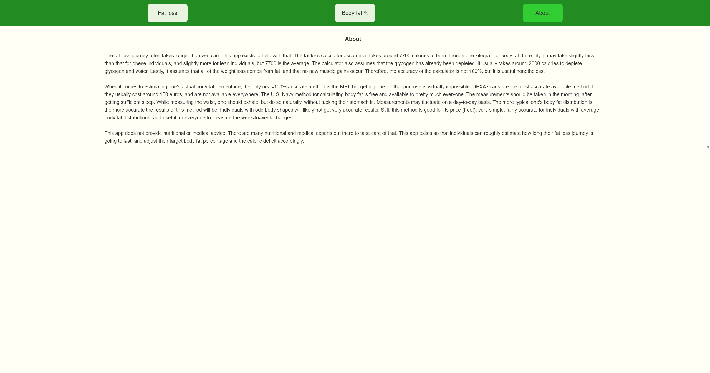

# Fat Loss — Timeline & Body-Fat Estimator

A small, client-side React + TypeScript app that helps you estimate:
- How long it may take to reach a target body-fat percentage based on a steady caloric deficit (fat-loss timeline).
- Your body-fat percentage using the U.S. Navy circumference method.

The app is lightweight, built with Vite and Tailwind CSS, and uses React Router for a simple multi-page experience.

## Table of Contents
- [Overview](#overview)
- [Features](#features)
- [Installation](#installation)
- [Project Structure](#project-structure)
- [Usage](#usage)
- [Screenshots](#screenshots)
- [Scripts](#scripts)
- [License](#license)

## Overview
This simple SPA allows users to estimate their current body fat percentage, as well as how long their journey to the one they aim for may take.

## Features
- Calculate the estimated number of days to reach a target body-fat percentage given weight, current & goal body-fat, and daily caloric deficit.
- Calculate body-fat percentage using the U.S. Navy circumference method (male/female inputs).
- Unit support: metric and imperial (kg/cm or lb/in).
- Small, dependency-light SPA using Vite and React.

## Installation
To run locally:

1. Clone the repository
```powershell
git clone https://github.com/Sebastijan-Dominis/fat_loss.git
```

2. Install the dependencies
```powershell
cd fat_loss
npm install
```

3. Start the server
```powershell
npm run dev
```

4. Open the URL shown by Vite in your browser (usually `http://localhost:5173`).

## Project Structure

Key files and folders:

- `src/` — application source
	- `fat_loss/` — Fat loss timeline page (`Fat_loss.tsx`)
	- `body_fat/` — Body fat page (`Body_fat.tsx`)
	- `components/` — reusable UI components (`Input.tsx`, `Select.tsx`, `Results.tsx`)
	- `nav/` — navigation components
	- `utils/conversion.ts` — unit conversion helpers
- `vite.config.ts` — Vite config
- `tailwind.config.js` — Tailwind CSS config

## Usage

The app contains three main routes:

- `/` — Fat Loss Timeline (default)
- `/bodyfat` — Body-Fat estimate using the U.S. Navy method
- `/about` — Info about the project

### Fat Loss Timeline
Enter:

- Weight (metric kg or imperial lb)
- Current body-fat %
- Goal body-fat %
- Daily caloric deficit (kcal)

The app computes:

- Fat to lose (kg)
- Total calories required (approx. 7700 kcal per kg of fat)
- Estimated days to goal = total calories / daily deficit

Example: weight 80 kg, current 25%, goal 15%, deficit 500 kcal/day →

```
Fat to lose = 80 * (0.25 - 0.15) = 8 kg
Calories to lose ≈ 8 * 7700 = 61,600 kcal
Days to goal ≈ 61,600 / 500 = 123 days
```

> Note: This is a simplified estimator — it assumes all weight lost is fat and the deficit remains constant. Use it as a planning tool, not a precise medical calculation.

### Body-Fat (U.S. Navy method)
Provide sex, unit system, and circumference measurements (height, neck, waist, and hips for females). The app uses the U.S. Navy formula to estimate body-fat percentage.

## Screenshots







## Scripts
Available npm scripts (from `package.json`):

- `npm run dev` — Start Vite dev server
- `npm run build` — Build production bundle (runs TypeScript build first)
- `npm run preview` — Serve built production files locally
- `npm run lint` — Run ESLint checks

## License
See the `LICENSE` file in this repository for license details.

**Contributions**
- Feel free to contribute if you wish. Open an issue or submit a pull request with a clear description of the change.

**Contact**
- Author: repository owner (see repository metadata).
